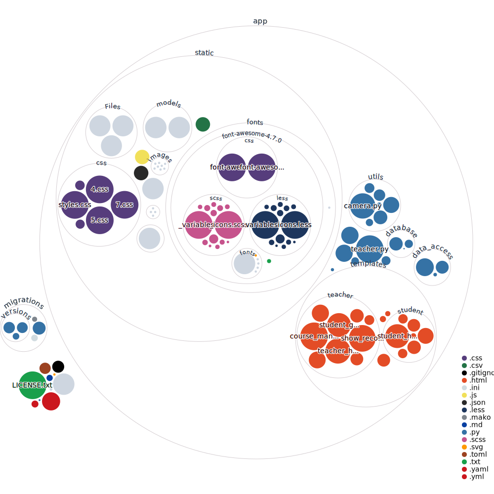

# Ativan(WIP)

# 项目依赖

## 安装python3.9

```shell
sudo apt-get install python3.9
```

## 安装项目依赖

克隆项目
进入到项目目录下

> [!NOTE]注意pipx nsurepath之后可能需要重启终端

```shell
pip install pipx
pipx ensurepath
pipx install pdm
pdm install --pre
```

## 安装mysql

```shell
sudo apt-get install mysql-server
```

### 数据库配置

需要在`.env`中填写SQLALCHEMY_DATABASE_URI以数据库连接信息

### 数据库初始化

执行test.sql以创建数据库和数据库表

# 项目运行

```shell
pdm run python main.py
```

然后访问 http://127.0.0.1:5000

# 项目可视化

<div style="text-align: center;">
    
</div>
